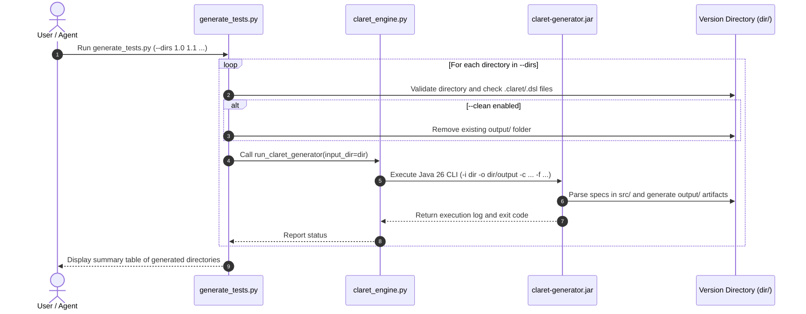

# test-generator — Batch MBT Test Suite & Output Generator

Executes `claret-generator.jar` locally across an array of version directories to generate complete Model-Based Testing (MBT) test suites, spreadsheets, textual specifications, formal graphs, and documentation into their respective `output/` directories.

## Key Capabilities

1. **Batch Processing**: Accepts multiple version directory paths (`--dirs 1.0 1.1 1.2` or `--dirs 20150617 20150618`).
2. **Sibling Directory Layout**: Automatically processes `.claret` / `.dsl` files (from either `src/` or root) and produces structured `output/` (with subdirectories `xlsx/`, `txt/`, `docx/`, `odt/`, `tgf/`, `alts/`, `xml/`).
3. **Flexible Coverage Criteria**: Supports `gt` (default), `gtp`, `art`, `complete`, `basic-only`, and `all-branches`.
4. **Multi-Format Generation**: Selectively generates `all` or specific formats (`xlsx`, `txt`, `docx`, `odt`, `xml`, `tgf`, `alts`).
5. **Output Cleaning**: Optional `--clean` flag to remove stale artifacts in `output/` before generation.

## CLI Invocation

```bash
# Generate test suites for specific version directories with default GT coverage
python .claude/skills/test-generator/scripts/generate_tests.py \
  --dirs 1.0 1.1 1.2 \
  --coverage gt \
  --formats all

# Generate with Adaptive Random Testing (ART) and clean previous outputs
python .claude/skills/test-generator/scripts/generate_tests.py \
  --dirs 20150617 20150618 \
  --coverage art \
  --clean
```

### Parameters

- `--dirs`: (Required) One or more version directories to process.
- `--coverage` (`-c`): (Optional) MBT coverage criteria: `gt` (default), `gtp`, `art`, `complete`, `basic-only`, `all-branches`.
- `--formats` (`-f`): (Optional) Comma-separated output formats (`all`, `xlsx`, `txt`, `docx`, `odt`, `xml`, `tgf`, `alts`). Default: `all`.
- `--flat`: (Optional) Output all generated files flatly in `output/` without format subdirectories.
- `--clean`: (Optional) Remove existing `output/` directory before generation.
- `--jar-path`: (Optional) Explicit path to `claret-generator.jar` (defaults to auto-detection in `bin/`, `lib/`, etc.).

## Execution Flow


