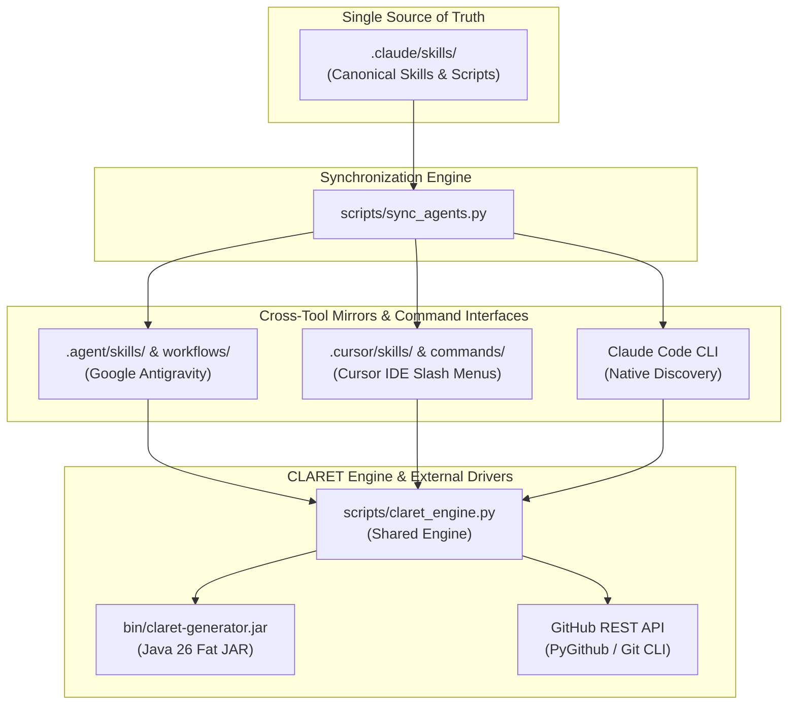
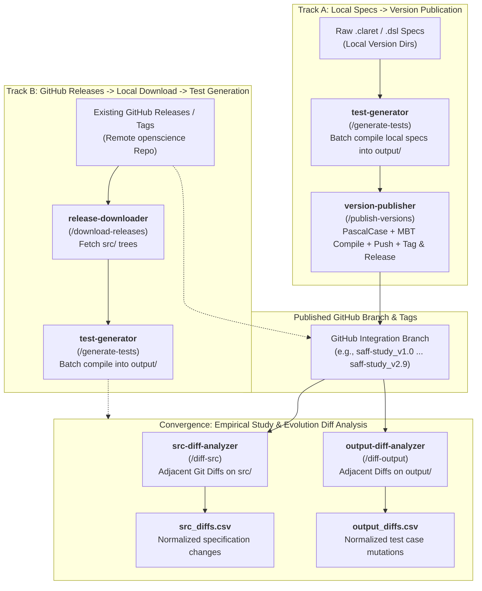

# CLARET Version Control System
### Cross-Agent Skills Suite for MBT Specification Versioning and Test Suite Diffing

**CLARET Version Control System** is an agentic tool suite designed for managing the evolutionary lifecycle of **CLARET** (*CentraL Artifact for Requirement Engineering and model-based Testing*) and DSL specifications. Built natively for **Claude Code** and interchangeable with **Google Antigravity** and **Cursor IDE**, this project automates specification compilation, GitHub release versioning, and diff extraction for Model-Based Testing (MBT) studies.

---

## ⚙️ Architecture & Process Workflow Diagrams

### 1. Cross-Agent Ecosystem & Synchronization Architecture


### 2. Evolutionary Study Execution Pathways & Convergence


---

## 1. Project Directory Structure

```text
claret-version-control-system/
├── .env.example                          <-- Template for environment variables
├── .gitignore                            <-- Git ignore rules
├── AGENTS.md                             <-- Universal cross-agent manifest
├── README.md                             <-- Project documentation (en-US)
├── requirements.txt                      <-- Python dependencies
├── scripts/
│   ├── claret_engine.py                  <-- Core shared engine (Git, GitHub, JAR, Normalizer)
│   ├── sync_agents.py                    <-- Cross-platform agent skill synchronizer
│   └── sync-agents.sh                    <-- Bash synchronizer wrapper
│
├── .claude/skills/                       <-- SOURCE OF TRUTH FOR SKILLS
│   ├── test-generator/                   <-- Feature 1: Batch generate output/ from specs in --dirs
│   │   ├── SKILL.md
│   │   └── scripts/generate_tests.py
│   ├── version-publisher/                <-- Feature 2: Process, generate test suite, commit, tag & release
│   │   ├── SKILL.md
│   │   └── scripts/publish_versions.py
│   ├── release-downloader/               <-- Feature 3: Download src/ from specific tags/releases
│   │   ├── SKILL.md
│   │   └── scripts/download_releases.py
│   ├── src-diff-analyzer/                <-- Feature 4: Adjacent tag diff for src/ .claret files (CSV)
│   │   ├── SKILL.md
│   │   └── scripts/diff_src.py
│   └── output-diff-analyzer/             <-- Feature 5: Adjacent tag diff for output/ test cases (CSV)
│       ├── SKILL.md
│       └── scripts/diff_output.py
│
├── .agent/                               <-- GOOGLE ANTIGRAVITY MIRROR (Auto-generated)
│   ├── skills/                           <-- Mirrored from .claude/skills/
│   └── workflows/                        <-- Antigravity workflows
│
└── .cursor/                              <-- CURSOR IDE MIRROR (Auto-generated)
    ├── skills/                           <-- Mirrored from .claude/skills/
    └── commands/                         <-- Cursor slash menu commands
```

---

## 2. Environment Setup & Configuration

### 2.1 Repository & Branch Checkout

To clone and check out the `claret-version-control-system` branch directly:

```bash
# Clone the repository and checkout the dedicated branch
git clone -b claret-version-control-system https://github.com/diegoquirino/openscience.git claret-version-control-system
cd claret-version-control-system
```

If you already have a local clone of `openscience`:

```bash
# Fetch and switch to the claret-version-control-system branch
git fetch origin
git checkout -b claret-version-control-system origin/claret-version-control-system
```

---

### 2.2 Prerequisites & System Requirements

Ensure the host environment meets the following runtime prerequisites:
- **Python 3.10+** (Tested on Python 3.10, 3.11, 3.12, 3.14): Used for executing the agent skills suite, diff analyzers, and synchronizer scripts.
- **Java Runtime Environment (JRE/JDK 21+ or 26)**: Required for executing the standalone `claret-generator.jar`.
- **Git 2.x+**: Required for local staging, branch management, committing, and tagging.
- **GitHub Personal Access Token (PAT)**: Required for REST API operations (creating releases, inspecting trees, and downloading release blobs).

---

### 2.3 Standalone Generator JAR Integration (Self-Contained vs Symbolic Links)

To avoid relying on external directory paths, `claret-version-control-system` automatically searches for `claret-generator.jar` in the following prioritized order:
1. `bin/claret-generator.jar` (Recommended self-contained location)
2. `lib/claret-generator.jar`
3. `./claret-generator.jar` (Project root)
4. Path configured in `.env` (`CLARET_JAR_PATH`)
5. `../claret-generator/target/claret-generator.jar` (Sibling project Maven target)

#### Option A: Direct Internal Checkout / Copy (Self-Contained)
Copy the compiled JAR directly into the local `bin/` directory:

```bash
# Linux / macOS
cp ../claret-generator/target/claret-generator.jar ./bin/claret-generator.jar

# Windows (PowerShell)
Copy-Item ..\claret-generator\target\claret-generator.jar .\bin\claret-generator.jar
```

#### Option B: Symbolic Links (Symlinks) / Hard Links
Use a symbolic link so that rebuilds of the generator are immediately reflected without copying:

```bash
# Linux / macOS
ln -sf ../claret-generator/target/claret-generator.jar ./bin/claret-generator.jar

# Windows (PowerShell - Developer Mode or Administrator)
New-Item -ItemType SymbolicLink -Path ./bin/claret-generator.jar -Target ../claret-generator/target/claret-generator.jar -Force

# Windows (CMD - Hard Link / No Administrator Privileges Required)
cmd /c mklink /H bin\claret-generator.jar ..\claret-generator\target\claret-generator.jar
```

---

### 2.4 Detailed Environment Variables (`.env`)

All sensitive credentials and default paths must be configured via a `.env` file placed at the root of `claret-version-control-system/`. This file is explicitly ignored by Git (`.gitignore`) to guarantee security.

A documented template is provided in [`.env.example`](.env.example):

```bash
# 1. Create your local .env file from the example template
cp .env.example .env    # Linux/macOS/Git Bash
copy .env.example .env  # Windows PowerShell/CMD
```

#### Environment Variables Reference Table:

| Variable Name | Required? | Default Value in Code | Description & Purpose |
| :--- | :---: | :--- | :--- |
| **`GITHUB_TOKEN`** | **Yes** (for API) | `None` | GitHub Personal Access Token (classic token with `repo` scope or fine-grained token with *Contents (Read/Write)* and *Releases (Read/Write)* permissions). |
| **`GITHUB_REPO`** | **Recommended** | `diegoquirino/openscience` | Target GitHub repository in `owner/repo` format. When configured in `.env`, all skill commands (`/publish-versions`, `/download-releases`, `/diff-src`, `/diff-output`) can be executed without passing `--repo`. |
| **`GITHUB_BRANCH`** | Optional | `claret-version-control-system` | Default integration/merging branch name used for publication. |
| **`CLARET_JAR_PATH`** | Optional | `bin/claret-generator.jar` | Path to the `claret-generator.jar` standalone executable. Defaults automatically to `bin/claret-generator.jar` or sibling `../claret-generator/target/claret-generator.jar`. |
| **`JAVA_CMD`** | Optional | `java` | Command or absolute binary path to the Java executable (Java 26 automatically detected). |
| **`LOG_LEVEL`** | Optional | `INFO` | Logging verbosity level (`DEBUG`, `INFO`, `WARNING`, `ERROR`). |

> [!IMPORTANT]
> **Zero-Exposure Policy & Zero-Argument Fallback**:
> - Never commit `.env` or real API keys to version control.
> - If `GITHUB_REPO` and `GITHUB_TOKEN` are set in `.env`, you do not need to provide `--repo` in skill calls or CLI commands.

---

### 2.5 Python Dependency Installation

It is recommended to use a dedicated Python virtual environment:

```bash
# Create and activate virtual environment
python -m venv venv

# On Linux / macOS:
source venv/bin/activate

# On Windows (PowerShell):
.\venv\Scripts\Activate.ps1

# Install required dependencies
pip install -r requirements.txt
```

#### Included Libraries:
- **`python-dotenv`**: Safe loading of `.env` configuration.
- **`PyGithub` & `requests`**: GitHub REST API client for tags, releases, commits, and tree extraction.
- **`openpyxl`**: Processing and diffing Excel (`.xlsx`) test suite artifacts.
- **`pydantic`**: Data validation and schema parsing.

---

### 2.6 Cross-Agent Skills Mirrors & Synchronization

The source of truth for agent skills is `.claude/skills/`. To expose these skills interchangeably across IDEs and agents:

#### Automated Synchronization (Recommended):
Run the cross-platform synchronizer:
```bash
python scripts/sync_agents.py
```
This automatically updates:
- `.agent/skills/` (Google Antigravity mirror)
- `.cursor/skills/` (Cursor IDE mirror)
- `.cursor/commands/` (Cursor slash `/` menu wrappers derived from `.agent/workflows/`)

---

### 2.7 Compiling the CLARET Generator Fat JAR (From Source)

If you are compiling the generator from the sibling project `claret-generator`:

```bash
# Navigate to claret-generator and compile with Maven (Java 26 / Fat JAR)
cd ../claret-generator
mvn clean package -DskipTests
cd ../claret-version-control-system

# Link or copy into bin/
cp ../claret-generator/target/claret-generator.jar ./bin/claret-generator.jar
```

---

### 2.8 Validating the Setup

Run the automated test suite and check multi-agent mirror synchronization:

```bash
# 1. Run unit test suite
python -m unittest discover -s tests -v

# 2. Check that skill mirrors and slash commands are in sync
python scripts/sync_agents.py --check
```

---

## 3. Skills Matrix & Usage

### 1. `test-generator` (`/generate-tests`)
Batch executes `claret-generator.jar` across an array of version directories passed via `--dirs`, parsing `.claret` / `.dsl` files in `src/` (or root) and producing complete test suites, spreadsheets, models, and reports into their respective `output/` folders.

```bash
python .claude/skills/test-generator/scripts/generate_tests.py \
  --dirs 1.0 1.1 1.2 \
  --coverage gt \
  --formats all
```

### 2. `version-publisher` (`/publish-versions`)
Iteratively **merges** an array of version directories into the main integrator directory (named after the target branch), renames files to PascalCase (preserving acronyms), executes `claret-generator.jar` (organizing `src/` and `output/`), pushes the incremental diff to the branch, creates tag (`<branch>_vX.Y`), and creates release (`<Branch Title> vX.Y`).

```bash
python .claude/skills/version-publisher/scripts/publish_versions.py \
  --version-dirs 20150617 20150618 20150619 \
  --branch saff-study
```

### 3. `release-downloader` (`/download-releases`)
Downloads exclusively the `src/` directory from a list of tags or releases into local segregated folders.

```bash
python .claude/skills/release-downloader/scripts/download_releases.py \
  --tags saff-study_v1.0 saff-study_v2.0 \
  --output-dir ./downloads
```

### 4. `src-diff-analyzer` (`/diff-src`)
Extracts granular diffs between adjacent tags/releases for `.claret` files in `src/` and exports a normalized CSV report:
`| # | file | system | origin_version | origin_content | target_version | target_content |`

```bash
python .claude/skills/src-diff-analyzer/scripts/diff_src.py \
  --tags saff-study_v1.0 saff-study_v2.0 saff-study_v3.0 \
  --output-csv ./reports/src_diffs.csv
```

### 5. `output-diff-analyzer` (`/diff-output`)
Extracts diffs between adjacent tags/releases for generated test cases in `output/` (filtering by format, scope `all_usecases` vs `all`, and coverage criteria like `GT`, `GTP`, `ART`) and exports a normalized CSV report.

```bash
python .claude/skills/output-diff-analyzer/scripts/diff_output.py \
  --tags saff-study_v1.0 saff-study_v2.0 \
  --formats txt xlsx \
  --scope all_usecases \
  --coverage gt \
  --output-csv ./reports/output_diffs.csv
```

---

## 4. Agent Synchronization

Whenever you add or modify skills in `.claude/skills/` or workflows in `.agent/workflows/`, synchronize all mirrors by running:

```bash
python scripts/sync_agents.py
```
