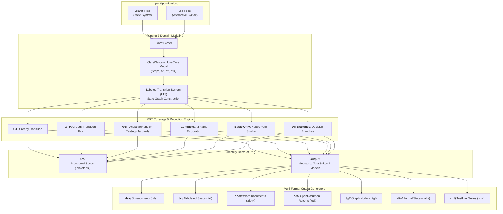

# CLARET Standalone Generator (UFCG / SPLab)
### Executable Model-Based Testing and Test Case Generator from `.claret` and `.dsl` Specifications (Java 26)

This tool was developed in the context of the **CLARET** (*CentraL Artifact for Requirement Engineering and model-based Testing*) project at **SPLab** (*Software Practices Laboratory*) of the **Federal University of Campina Grande (UFCG)**.

The **`claret-generator`** project operates as a **100% Standalone (Fat JAR / CLI)** tool compiled in **Java 26**, supporting formal Model-Based Testing (MBT) coverage criteria, automated folder organization with `src/` and `output/` as siblings at the same level (moving processed source files into `src/`), and full support for both `.claret` and `.dsl` specifications.

---

## ⚙️ Workflow & Architecture Diagrams

### 1. Generation Engine & Multi-Format Exporter Pipeline


### 2. Standalone CLI Execution Flow
```mermaid
sequenceDiagram
    autonumber
    actor User as User / CI / Agent
    participant CLI as Main (CLI Entrypoint)
    participant Parser as ClaretParser
    participant Engine as ClaretProcessor
    participant Exporter as Generators (XLSX, TXT, DOCX, XML, etc.)
    participant FS as File System (src/ & output/)

    User->>CLI: Execute JAR (-i &lt;dir&gt; -o &lt;dir/output&gt; -c gt -f all)
    CLI->>FS: Scan directory for *.claret and *.dsl files
    CLI->>Parser: Parse specification files into System & UseCase AST
    Parser-->>CLI: Return parsed ClaretSystem domain models
    CLI->>Engine: Build LTS graph and apply coverage criteria (e.g. GT / ART)
    Engine-->>CLI: Return optimized test case suites (TestCase objects)
    CLI->>Exporter: Generate requested formats (XLSX, TXT, DOCX, TGF, XML)
    Exporter->>FS: Write artifacts into output/ subdirectories
    CLI->>FS: Move processed .claret/.dsl files into sibling src/ folder
    CLI-->>User: Process completed successfully
```

---

## 1. Project Directory Structure

```text
claret-generator/                         <-- Project Root
├── pom.xml                               <-- Maven configuration (Java 26, Apache POI, Commons CLI, JUnit 5)
├── README.md                             <-- Main project documentation (en-US)
├── CLARET_EXECUTABLE_GUIDE.md            <-- Comprehensive technical user guide (en-US)
├── .gitignore                            <-- Git ignore rules
│
├── samples/                              <-- Sample test specifications
│   ├── login-minitest.claret             <-- Standard Xtext syntax
│   └── login-minitest-alternative-format-dsl.claret <-- Alternative DSL syntax
│
├── src/
│   ├── main/java/br/edu/ufcg/splab/claret/
│   │   ├── Main.java                     <-- CLI entrypoint and directory orchestrator
│   │   ├── model/                        <-- Domain models and coverage enums
│   │   │   ├── ClaretSystem.java         <-- System model
│   │   │   ├── UseCase.java              <-- Use Case model
│   │   │   ├── Step.java                 <-- Step model with af/ef/bfs annotations
│   │   │   ├── AlternativeFlow.java      <-- Alternative flows
│   │   │   ├── ExceptionFlow.java        <-- Exception flows
│   │   │   ├── Actor.java                <-- Actors model
│   │   │   ├── TestCase.java             <-- Test case model with useCaseVersion
│   │   │   ├── TestStep.java             <-- Test step with actor, action, and expected result
│   │   │   └── CoverageCriteria.java     <-- MBT coverage criteria enums (gt, gtp, art, complete)
│   │   ├── parser/
│   │   │   └── ClaretParser.java         <-- Multi-syntax parser (.claret and .dsl)
│   │   ├── engine/
│   │   │   └── ClaretProcessor.java      <-- Test case extraction and reduction engine (Greedy, ART Jaccard)
│   │   └── generator/
│   │       ├── XlsxGenerator.java        <-- Excel spreadsheet generator (.xlsx)
│   │       ├── TxtGenerator.java         <-- Tabulated text specification generator (.txt)
│   │       ├── LtsGenerator.java         <-- Trivial Graph Format generator (.tgf and -annotated.tgf)
│   │       ├── AltsGenerator.java        <-- ALTS formal state specification generator (.alts)
│   │       ├── DocxGenerator.java        <-- Microsoft Word report generator (.docx)
│   │       ├── OdtGenerator.java         <-- OpenDocument Text report generator (.odt)
│   │       └── TestLinkXmlGenerator.java <-- TestLink XML suite generator
│   │
│   └── test/
│       ├── java/br/edu/ufcg/splab/claret/
│       │   ├── ClaretParserTest.java     <-- Parser tests for both syntax styles
│       │   ├── ClaretProcessorTest.java  <-- Coverage criteria tests
│       │   ├── XlsxGeneratorTest.java    <-- XLSX spreadsheet generation tests
│       │   ├── TxtGeneratorTest.java     <-- Tabulated TXT generation tests
│       │   ├── LtsGeneratorTest.java     <-- TGF graph generation tests
│       │   ├── AltsGeneratorTest.java    <-- ALTS specification tests
│       │   ├── DocxGeneratorTest.java    <-- DOCX Word document tests
│       │   ├── OdtGeneratorTest.java     <-- ODT OpenDocument tests
│       │   ├── TestLinkXmlGeneratorTest.java <-- TestLink XML suite tests
│       │   └── ClaretDirectoryTreeAndExtensionsTest.java <-- Directory tree and moving sources tests
│       └── resources/
│           ├── login-minitest.claret
│           └── login-minitest-alternative-format-dsl.claret
│
├── target/                               <-- Maven build output directory (cleaned via `mvn clean`)
│   └── claret-generator.jar              <-- Standalone executable shaded fat JAR
│
├── src/                                  <-- Sibling source directory (same level as output/)
│   └── *.claret / *.dsl                  <-- Specification files moved after successful processing
│
└── output/                               <-- Sibling output directory (same level as src/)
    ├── tgf/                              <-- Graph transition models (.tgf and -annotated.tgf)
    ├── xlsx/                             <-- Excel test suites (--GT-, --GTP-, --ART-, --Complete-)
    ├── txt/                              <-- Tabulated text specifications (.txt)
    ├── docx/                             <-- Microsoft Word formatted reports (.docx)
    ├── odt/                              <-- OpenDocument Text formatted reports (.odt)
    ├── alts/                             <-- ALTS formal state specifications
    └── xml/                              <-- TestLink importable XML suites
```

---

## 2. Supported Coverage Approaches (`-c` / `--coverage`)

| CLI Option (`-c`) | Suite Name in `.xlsx` / `.txt` (`Suite Type`) | Algorithm and Description | Generated Suffix |
| :--- | :--- | :--- | :--- |
| **`gt`** *(Default)* | **Reduced (Greedy Heuristic - Transition Coverage)** | **Greedy Transition Coverage:** Applies a greedy heuristic algorithm to select the minimal test suite that covers every transition (edge) in the use case graph. | `--GT-.xlsx` / `--GT-.txt` |
| **`gtp`** | **Reduced (Greedy Heuristic - Transition Pair Coverage)** | **Greedy Transition Pair Coverage:** Selects test paths that cover every consecutive pair of transitions ($T_i \to T_j$). | `--GTP-.xlsx` / `--GTP-.txt` |
| **`art`** | **Reduced (Adaptive Random Testing by Jaccard Distance)** | **Adaptive Random Testing (ART):** Uses Jaccard distance/dissimilarity between test paths to maximize functional diversity and early fault detection. | `--ART-.xlsx` / `--ART-.txt` |
| **`complete`** | **Complete Test Suite** | **Complete Path Coverage:** Generates all explored graph paths from initial state to terminal states without applying reduction. | `--Complete-.xlsx` / `--Complete-.txt` |
| **`basic-only`** | **Basic Flow Only (Happy Path)** | **Happy Path:** Generates only the test case for the basic flow (*Smoke Testing*). | `--Basic-.xlsx` / `--Basic-.txt` |
| **`all-branches`** | **Reduced (Decision Branches)** | **Branch Coverage:** Focuses on conditional branches (alternative flows and exception flows). | `--Branches-.xlsx` / `--Branches-.txt` |

---

## 3. Artifact Formatting Standards

### XLSX (Excel Spreadsheets) & TXT (Tabulated Text)
- **Single Use Case Files (`<UseCase>--GT-.xlsx` / `<UseCase>--GT-.txt`)**:
  - Header: Contains `System: <Name>`, `Use Case: <Name>`, `Version: <v>`, `Suite Type: <Type>`, `Size: N`, `Creation Date: <date>`.
  - Test Cases: Start directly with `Test Case ID: TC...` (use case name is not redundantly repeated before each test case).
- **Consolidated Files (`all_usecases--GT-.xlsx` / `all_usecases--GT-.txt`)**:
  - Header: Displays `Use Case: All Use Cases` grouped into sheets/sections by `System Name` (no global version in header).
  - Test Cases: Each test case has a line immediately above `Test Case ID` displaying `Use Case: <Name>` and `Version: <v>`.

### DOCX (Word) & ODT (OpenDocument)
- **Typographic & Style Hierarchy**:
  - **Title**: 20pt Bold (Navy Blue `#1A365D`)
  - **Subtitle**: 10pt Italic (Gray `#555555`)
  - **Heading 1**: 15pt Bold (`Use Case: <Name> (v<Version>)`)
  - **Heading 2**: 12pt Bold (Accent Blue `#2B6CB0` - `[<TC_ID>] <Summary>`)
  - **Metadata**: Structured paragraphs with bold labels (`System:`, `Preconditions:`, `Postconditions:`).
  - **Step Tables**: Accent header background with bold white text and thin borders.

### XML (TestLink)
- **Consolidated Suite (`all_usecases_testlink.xml`)**: Creates nested sub-testsuites `<testsuite name="<UseCaseName>">` grouped under the root `<testsuite name="Consolidated Test Suite">`.

---

## 4. Standalone CLI Usage Guide (Java 26)

After compiling with `mvn package`, the standalone executable shaded JAR is available at `target/claret-generator.jar`:

```bash
# 1. Process directory containing .claret and .dsl files (Moves to src/ and generates output/tgf/, output/xlsx/, output/txt/, output/docx/, etc.)
java -jar target/claret-generator.jar -i 20150617 -o 20150617/output -f all -c gt

# 2. Generate tabulated text format (TXT)
java -jar target/claret-generator.jar -i 20150617 -o 20150617/output -f txt -c gt

# 3. Generate Microsoft Word format (DOCX)
java -jar target/claret-generator.jar -i 20150617 -o 20150617/output -f docx -c gt

# 4. Generate with Transition Pair Coverage (GTP)
java -jar target/claret-generator.jar -i 20150617 -o 20150617/output -f xlsx -c gtp

# 5. Generate with Adaptive Random Testing (ART)
java -jar target/claret-generator.jar -i 20150617 -o 20150617/output -f xlsx -c art

# 6. Output files flatly in root output directory (without format subdirectories)
java -jar target/claret-generator.jar -i 20150617 -o 20150617/output --flat -f all -c gt
```

---

## 5. How to Import Tests into TestLink

1. Log into your TestLink server and select the **Test Project**.
2. Navigate to **Test Specification** in the top navigation bar.
3. Select the target test suite node in the left tree.
4. Click the gear icon (**Actions**) on the right pane and choose **Import**.
5. Select the generated `<date>/output/xml/*_testlink.xml` file.
6. Verify **File Type: XML** and click **Upload file**.
